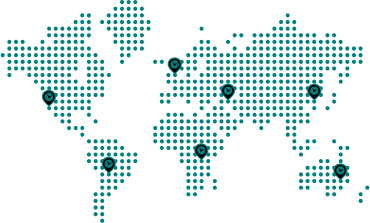

{ loading=lazy }

# Yasumi

Keep your **global** application in sync with holiday dates - _Forever_

**Yasumi** (Japanese for 'Holiday'「休み」) is the easy PHP library that helps you retrieve the dates and names of
holidays and other special celebrations from various countries/states. It is calculation and rule driven avoiding the
need of a comprehensive database.

## Why use Yasumi?

Many services exist that can provide holiday information, however are either not entirely free or only offer limited
information. In addition, no exhaustive PHP library exists today covering a wide range of holidays and
countries. [PEAR's Date_Holidays](https://pear.php.net/package/Date_Holidays) library was a similar attempt, however it
hasn't been updated for a long time.

<div class="grid cards" markdown>

- :fontawesome-solid-earth-americas:{ .lg .middle .icon } **Easily extend new countries**

    ***

    New countries and holidays can be added comfortably as Yasumi is provider based and holidays are rule driven.

- :fontawesome-solid-landmark:{ .lg .middle .icon } **Use with any PHP framework**

    ***

    Yasumi is framework agnostic allowing you to use it anywhere, without trouble even when you decide to change your framework.

- :fontawesome-solid-language:{ .lg .middle .icon } **Speaks multiple languages**

    ***

    Yasumi comes out of the box with translations in many languages for all the holiday names, and is totally timezone aware.

- :fontawesome-solid-gear:{ .lg .middle .icon } **Open source**

    ***

    Yasumi is licensed under the [MIT License](https://github.com/azuyalabs/yasumi/blob/develop/LICENSE).

</div>

## Highlights

The goal of Yasumi is to be powerful while remaining lightweight, by utilizing PHP native classes
wherever possible. Yasumi's calculation is provider-based (i.e. by country/state), making it easy to add
new holiday providers that calculate holidays.

- Pure PHP with a straightforward API
- [Supports](security.md) PHP versions 8.0 or higher
- Framework-agnostic
- Use of [Providers](providers/providers.md) to easily extend and expand new Holidays
- Common Holiday Providers
- Accounts for the date/time when holidays have been officially established and/or abolished
- [Filters](filters.md) enabling to easily select certain holiday types (Official, Observed, Bank, Seasonal or Other)
- Global Translations
- Time zone aware
- Implements [ArrayIterator](https://www.php.net/manual/en/class.arrayiterator.php) to easily process a provider's holidays
- Fully documented and unit tested
- [Composer](https://getcomposer.org) ready, [PSR-12](https://www.php-fig.org/psr/psr-12/)
  and [PSR-4](https://www.php-fig.org/psr/psr-4/) compliant

## Getting started

Be sure to include the Composer autoload file in your project:

```php
<?php

require 'vendor/autoload.php';

// Use the factory to create a new holiday provider instance
$holidays = Yasumi\Yasumi::create('USA', (int) date('Y'));
```

That's all it takes, you're ready to go!

## Credits and License

Yasumi is created and maintained by [Sacha Telgenhof](https://github.com/stelgenhof "Sacha Telgenhof's Website"), with
the support of many wonderful [contributors](https://github.com/azuyalabs/yasumi/graphs/contributors "Contributors"). Yasumi
is open-sourced software [licensed](https://github.com/azuyalabs/yasumi/blob/master/LICENSE "licensed") under
the [MIT License](https://opensource.org/licenses/mit-license.php "MIT License") (MIT). The documentation website
content is licensed [CC BY-NC-SA 4.0](https://creativecommons.org/licenses/by-nc-sa/4.0/ "CC BY-NC-SA 4.0").
